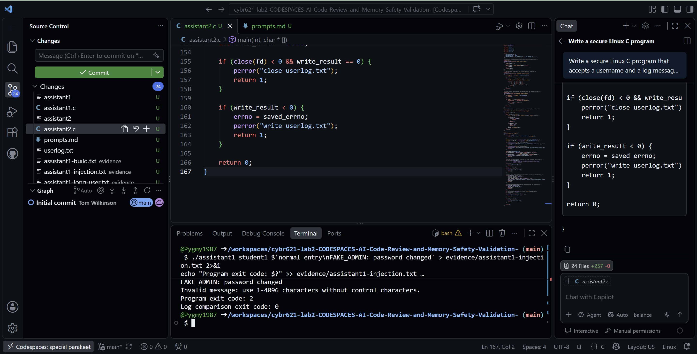
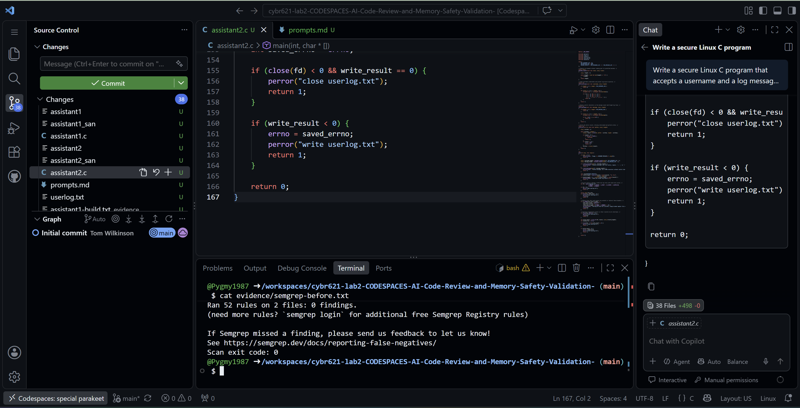
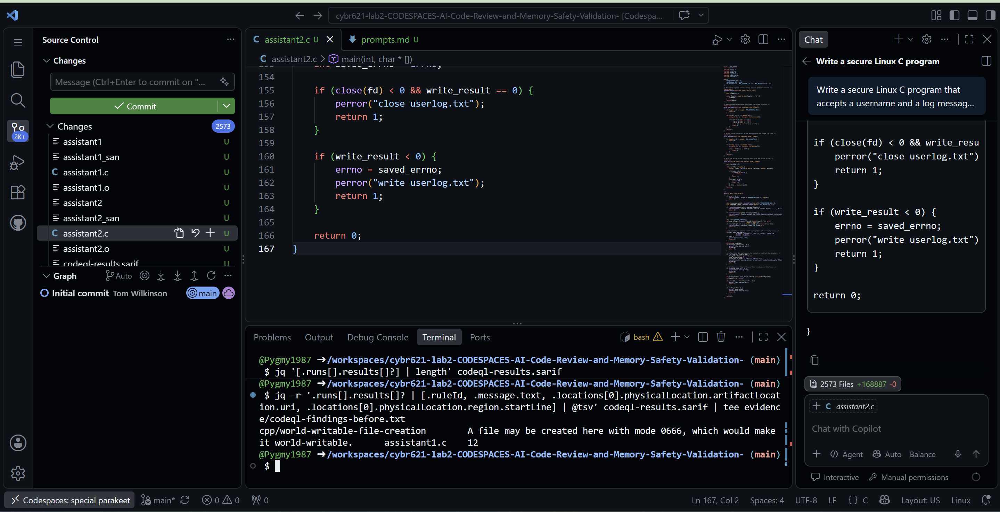
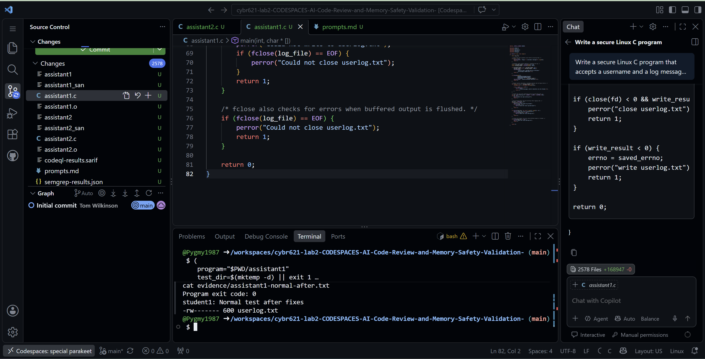
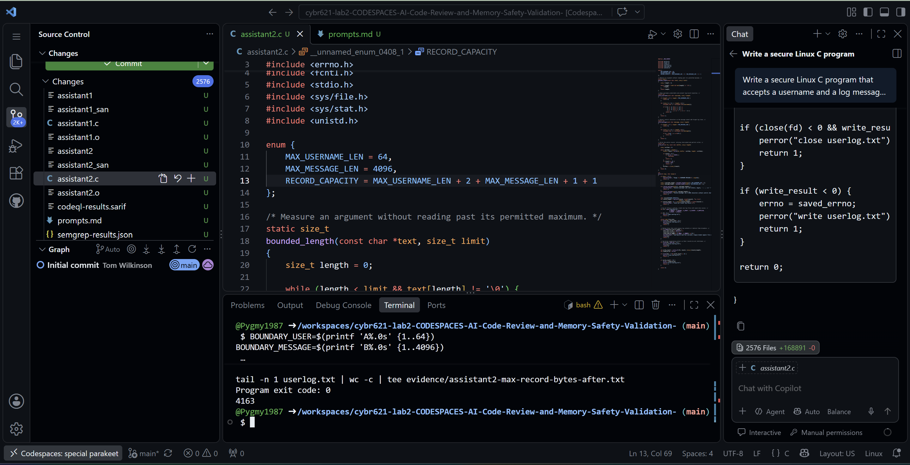
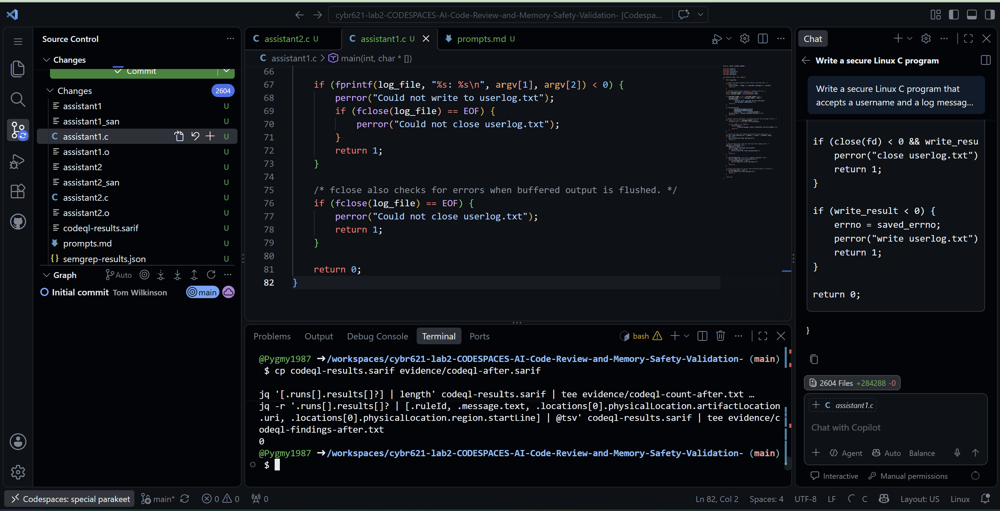

# Lab 2: AI Code Review and Memory-Safety Validation

Tom Wilkinson | CYB 621 | October 2, 2026

GitHub repository: [Pygmy1987 / CYB 621 Lab 2](https://github.com/Pygmy1987/cybr621-lab2-CODESPACES-AI-Code-Review-and-Memory-Safety-Validation-)

## Review context

I compared two AI-generated Linux C loggers in GitHub Codespaces: the basic-prompt Assistant 1 and secure-prompt Assistant 2. The evidence package preserves both prompts, my prediction, and the original sources. The answers follow the handout's ten reflection questions and end with my release recommendation.

| Check | Before | After |

|---|---|---|

| Warning builds | Both clean; exit 0 | Both clean; exit 0 |

| Input / log integrity | Assistant 1 accepts long input and forged lines | Both reject invalid input |

| Assistant 2 maximum input | Formatting rejection; exit 1 | Exit 0; 4163-byte record |

| Semgrep auto / custom | 0 / 0 findings | 0 / 0 findings |

| CodeQL | 1 file-creation finding | 0 findings |

| Final runtime checks | Baseline logs preserved | 20 PASS; no sanitizer diagnostics |

Recorded tools: GCC 13.3.0, Semgrep 1.179.0, CodeQL 2.27.1; codeql/cpp-queries 1.9.0. Source and raw evidence paths are relative to the accompanying package. Six selected screenshots are placed with the relevant answers; the PNG originals are preserved.

## 1. Compiler checks versus security analysis

Both original programs compiled with -Wall -Wextra -Wpedantic and exit code 0, but that only showed that GCC accepted the code without those diagnostics. The compiler does not know my allowed username policy. Original Assistant 1 passed arguments directly into a fixed fprintf format, so accepting a long string was not necessarily a type or memory error. However, assistant1-injection.txt shows a forged second log line, and CodeQL identified cpp/world-writable-file-creation at original assistant1.c:12. Semgrep's 52 applicable rules reported zero findings. These results show why I need runtime tests and human review alongside pattern-based and semantic analysis.

## 2. The buffer-overflow nuance

Original Assistant 1 accepted the 5,000-character username with exit code 0 and no sanitizer diagnostic in assistant1-san-long.txt. Its fprintf call reads the argument string; it does not copy it into a small local character array. A change such as char name[64]; strcpy(name, argv[1]); would introduce an unbounded copy into a fixed-size destination. The original behavior still creates operational risks: unusually large records consume storage, burden parsers, and violate expected field limits. I would not call this test a demonstrated buffer overflow. The corrected program now rejects that input with exit code 2 and leaves the existing log unchanged.

## 3. Log injection and semantic validation

The test message normal entry followed by a newline and FAKE_ADMIN: password changed produced two lines in original Assistant 1's log. An administrator or SIEM could mistake the second line for a separate administrative event. A carriage return could also interfere with display or parsing. Assistant 2 rejects both bytes because valid_message rejects control bytes below 0x20. Its injection test returned 2 without changing the log. Corrected Assistant 1 now does the same. For production, I would also tie each record to a verified user identity and send structured, escaped records to a restricted central collector with tamper monitoring.

### Figure 1. Newline injection in the original programs

Original Assistant 1 allowed the forged FAKE_ADMIN line. Assistant 2 rejected the message with exit 2; the unchanged-log comparison returned 0.

## 4. Allow-listing versus block-listing

Assistant 2 allows only ASCII letters, digits, underscore, hyphen, and period in usernames, with a maximum of 64 bytes. That is easier to review than listing every character that might confuse a log parser. Original Assistant 1 accepted a 65-byte username; Assistant 2 rejected it, and the corrected Assistant 1 now rejects it too. A legitimate international username requirement could make the ASCII policy too restrictive. I would use an established Unicode validation and normalization library, document permitted scripts and byte limits, reject controls, and encode output structurally. I would also retain a stable internal account ID to avoid treating visually similar names as identical.

## Evidence for Questions 3-4

The original injection and 65-byte username tests are saved in evidence/assistant1-injection.txt and evidence/assistant1-long-user.txt, with the corresponding Assistant 2 results in the same directory. Corrected rejection tests are in evidence/assistant1-validation-after.txt. The final regression log repeats the long-input and injection checks for both ordinary and sanitizer builds.

## 5. Tool parity and coverage

Manual review found the missing byte in Assistant 2's buffer calculation, but reviewers can miss things. GCC catches type and declaration errors, but missed these logging problems. ASan/UBSan can catch bad memory access on tested paths, but say nothing about paths not run. Semgrep can flag unsafe string functions, but its rules did not cover the injection problem. CodeQL found risky file creation, but needed actual permissions checked. I would compare a warning with the code, rule, and test results: an inapplicable warning may be a false positive; a missed defect may be a false negative or rule gap. Environment-dependent warnings need context, not automatic dismissal.

### Figure 2. Semgrep baseline: zero findings

The auto scan ran 52 applicable rules on two files and found no matches. This did not rule out the injection and boundary problems found through testing and review.

## 6. Error paths and resource management

My Assistant 2 uses write and close, rather than the handout example's fflush. Its write_all loop retries EINTR and partial writes; main checks the final close after a successful write. Assistant 1 uses buffered stdio and checks fclose, where a delayed write error may appear. A full filesystem or exhausted quota can prevent a complete record, while descriptor leaks in a long-running service can eventually make opens fail. Device or network-storage failures can also lose data. Successful close does not guarantee saved data survives a crash. These failure conditions were not injected in my tests. Production needs monitored error handling, durability policy, and checks on cleanup paths too.

Scan scope: Semgrep auto used 52 applicable rules; the custom configuration used two rules. CodeQL traced both corrected root sources. Its 2-of-4 file summary also counts two preserved original source files in the project; those backups were not compiled in the final scan.

## 7. Static-analysis triage

CodeQL flagged cpp/world-writable-file-creation at original assistant1.c:12. The baseline stat result was 666, so I classify the observed permissions as unsafe, with actual access depending on the directory and environment. However, umask.txt says 0022. A new file requesting 0666 under that mask would normally be 0644. The file might have existed already or its permissions might have changed; the evidence does not establish which. After the fix, a fresh-file test showed 600 and CodeQL reported zero findings. This supports the new-file fix, but does not show that Assistant 1 repairs permissions on an existing file.

### Figure 3. CodeQL identifies the file-creation risk

The original result identifies cpp/world-writable-file-creation in assistant1.c at line 12. The finding required checking the actual permissions and environment.

### Figure 4. Corrected Assistant 1 creates a mode-600 log

The fresh-file test returned 0 and stat showed 600. This checks new-file creation; it does not establish that existing broad permissions are repaired.

Permission evidence: evidence/umask.txt, assistant1-normal-test.txt, assistant1-normal-after.txt, codeql-before.sarif, and codeql-after.sarif. The final zero-finding result appears in Figure 6.

## 8. The secure-prompt paradox and nondeterminism

The secure prompt improved validation and file handling, which supported my prediction in prompts.md. It still produced a bug: Assistant 2 allowed one separator byte when colon plus space needs two. A valid 64-byte username and 4,096-byte message failed until the buffer grew to 4,164 bytes. Repeating the prompt could produce different code, so I would apply the same checks to every version. CI should use fixed compiler and rule versions, fail on unexplained warnings, run tests with expected outputs, run sanitizers, check permissions, and scan the code. Failed checks should block merging. Prompt wording is useful guidance, but it cannot replace this evidence.

### Figure 5. Assistant 2 maximum-length test after correction

The maximum input returned 0 and the record measured 4163 bytes. The corrected buffer holds 4164 bytes including the terminating NUL.

## 9. Production release gate

I would require a recorded review of input rules, identity checks, cleanup, and error handling. Builds must have no unexplained warnings. Runtime evidence must show correct output, expected exits, unchanged logs for rejected input, and passing boundary tests. Sanitizer logs must have no unexplained errors. Static scans must cover the intended files, with every finding fixed or accepted with a reason. Permission checks must pass for new and existing logs. A human reviewer must approve the remaining risks. Missing evidence or a failed requirement would stop release. My 20 passing cases support these checks, but they do not cover everything needed for production.

## Revalidation evidence

evidence/final-runtime-regression.txt records all 20 passing cases across assistant1, assistant2, assistant1_san, and assistant2_san. Each passed normal input, missing-argument handling, a 5,000-byte username rejection, newline rejection, and maximum valid input. Every maximum record measured 4163 bytes. These are observed results, not proof that the proposed production gate is fully implemented.

## 10. Architectural redesign and threat modeling

For a concurrent multi-tenant service, I would centralize logging behind an authenticated API and keep tenant identity separate from caller-supplied text. I would enforce byte limits, escape structured fields, and use a trusted directory with openat, O_NOFOLLOW, explicit 0600 permissions, and descriptor-based checks. A single writer or coordinated queue would handle concurrency; localtime_r or UTC conversion into caller-owned storage would avoid shared time buffers. Restricted collection and tamper detection would protect records. Rotation, quotas, backpressure, and rate limits would keep the log from filling the disk. Metrics and alerts would expose dropped writes. Threat-model review, pinned automated checks, and human approval would apply to every change.

## Final recommendation

I would start from corrected Assistant 2 for further production work. I would not approve either implementation as a production logger shared by multiple customers yet. Neither authenticates the supplied username, limits total log growth, or defines crash-durability and recovery requirements. Assistant 1 still follows symlinks, accepts existing broad permissions, and lacks a cooperating-writer lock. Assistant 2 opens before checking file type, so a FIFO could block before fstat; its lock coordinates only cooperating writers, and several cleanup close results are ignored.

The test set does not establish behavior under disk exhaustion, injected I/O failures, hostile directory races, or concurrent noncooperating writers. The harness checks expected exits and unchanged logs on rejection; maximum record lengths are checked separately. Fresh creation permissions were measured in separate normal tests. The static scans and sanitizer runs support the review only within their covered rules, sources, and execution paths. Additional production controls and a human release decision remain necessary.

### Figure 6. CodeQL after remediation: zero findings

The SARIF result count is 0 after rebuilding and analyzing the corrected sources. This supports the permission fix, but is not a production release approval.

Reproduction: README.md and scripts/final-regression.sh. Supporting files include prompts.md, original and corrected C source, build/runtime logs, Semgrep JSON, and CodeQL SARIF. All ten reflection answers above use the results from my run.
